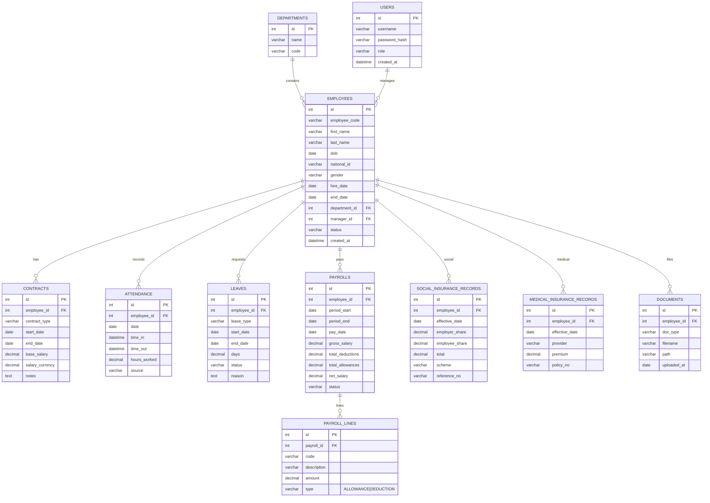

**HR System ERD (مخطط الكيانات والعلاقات)**

مرحباً — هذا مخطط ERD مبدئي لنظام شؤون عاملين احترافي يغطي الموظفين، العقود، الحضور، الرواتب، والاستحقاقات التأمينية.

ملاحظات تصميمية سريعة:
- جداول `PAYROLLS` و`PAYROLL_LINES` تسمح بتفصيل أي بند (بدلات/اقتطاعات). هذا يسهل طباعة قسائم الرواتب.
- `SOCIAL_INSURANCE_RECORDS` و`MEDICAL_INSURANCE_RECORDS` تحتفظان بتاريخ التغيرات (effective_date) حتى يمكن حساب الاستقطاعات حسب فترة.
- `CONTRACTS` تفصل بيانات عقد الموظف (может быть multiple contracts per employee).

التالي: أُنشئ ملف ترحيل SQL مبدئي لإنشاء هذه الجداول مع المفاتيح الأساسية والأجنبية، ثم أجربه على قاعدة بيانات محلية إذا رغبت.
